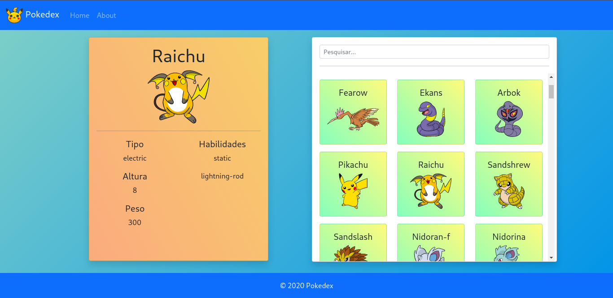
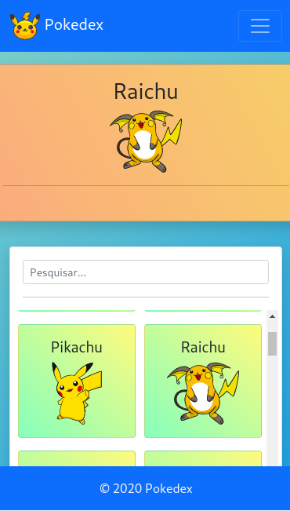
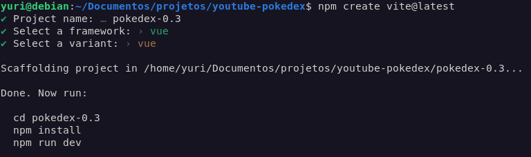
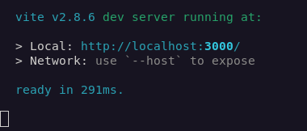
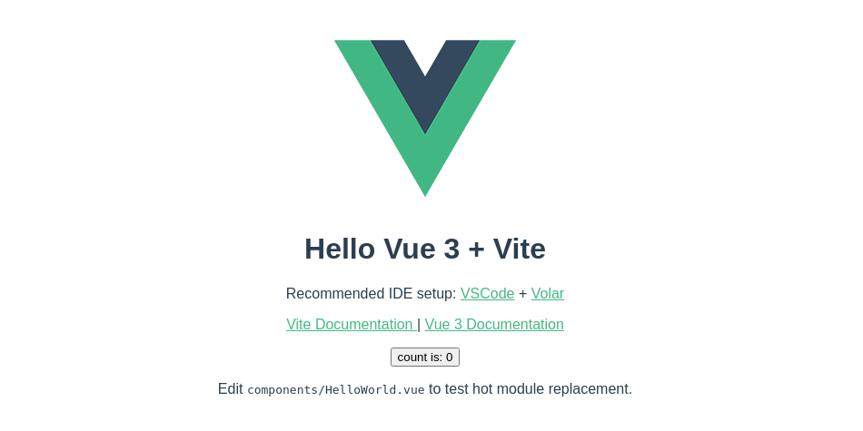
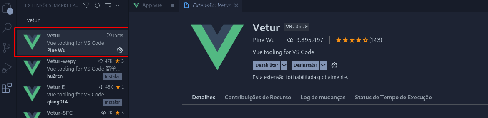
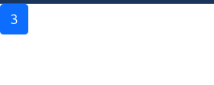
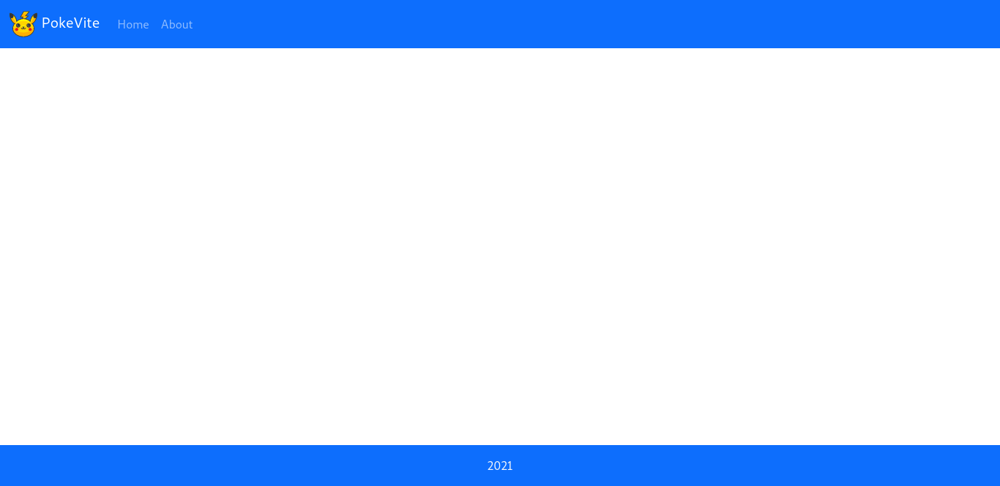
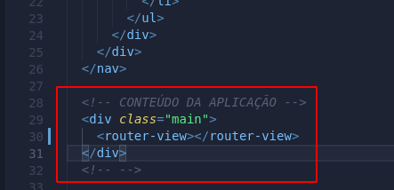
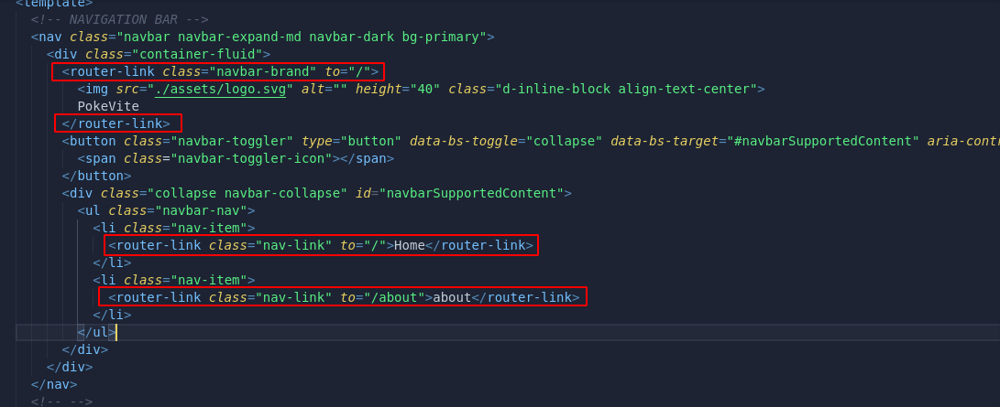

# Criando um pokedex com Vue 3 + Vite

## Objetivo
O objetivo desse projeto é desenvolver um aplicativo SPA (Single Page Application) utilizando Vue.js 3 em junção com o Framework Vite. 
Nesse projeto vamos estudar conceitos básivos do Vue.js, diretivas, arquitetura de applicações frontend, consumo de APIs, ferramentas que ajudam no dia-a-dia para otimizar tempo de desenvolvimento, roteamento e deploy da nossa aplicação no Netlify.
Ao terminar o curso você irá ter atualizado seus conhecimentos caso você já conheça o Vue 2 ou caso esteja começando pelo Vue 3 irá entender como funciona Aplicações SPA desenvolvidas com Vue.js.

---

## Apresentando o projeto



Nessa trilha iremos desenvolver a PokeVite (Pokedex feita com framework Vite ).  
Será uma aplicação que consome a Api de Pokemons [PokeAPI](https://pokeapi.co/) e traz em uma listagem, ao clicar no pokemon ele aparecerá no card maior com algumas especificações do Pokemon.  
A aplicação será responsiva, podendo ser consumida por Desktop, tablet ou Mobile.



---
## Preparando o Ambiente
Para darmos início ao nosso projeto precisaremos preparar o ambiente de desenvolvimento, para isso vamos precisar das seguintes ferramentas:
1. [Node.js](https://nodejs.org/en/) (Sugiro utilizar a versão estável LTS).
2. [Visual Studio Code](https://code.visualstudio.com/)

> Após instalação do Node.js abra o terminal e rode o comando "node -v", você deverá ver a versão do node.js e depois rode o comando "npm -v" e verá a versão do npm. Caso esses comandos não retorne nada, reinstale, procure no google o que pode estar acontecendo ou ente em contato comigo que tento te ajudar.

---
## Criando projeto com Vite
Para criar um novo projeto vamos acompanhar a documentação do [Vite](https://vitejs.dev/). Seguindo a documentação em **Get Started**, podemos trabalhar com NPM, YARN ou PNPM. Nesse projeto vamos usar o NPM, então abra o terminal e navegue até a pasta onde você quer criar o projeto e digite o comando:
```shew
npm create vite@latest
```
O Vite irá perguntar o nome do projeto, qual framework você vai querer utilizar e se você quer usar Vue normal (com JavaScript mesmo) ou Vue com TS.  
Então dê um nome ao seu projeto (Nome de sua preferência), o framework será o Vue, e a vaiant será Vue (com JavaScript mesmo).  
No meu caso ficou assim:


Após esse procedimento digite os comandos sugeridos pelo Vite.  

Entre na pasta do projeto:
```shew
cd <NOME_DO_SEU_PROJETO>
```
Instale as dependências necessárias:
```shew
npm install
```
Rode o projeto para testar:
```shew
npm run dev
```
Após esses procedimentos você terá asegunte saída em seu terminal:


Isso significa que o servidor está rodando e deu tudo certo até aqui.

> Caso você tenha alguma menságem de erro, tente entender o que a conteceu em em último caso delete o projeto e faça o processo novamente para ver se resolve.

Após ver no terminal a imagem a cima, abta seu navegador na segunte url [localhost:3000](http://localhost:3000/) e você deve ter uma tela como essa:



---
## Iniciando o desenvolvimento
> Instale em seu VScode a extensão Vetur, ela vai fazer o editor de textos interpretar o código do Vue.js


Primeiro passo será limpar o nosos projeto para remover essas explicações do que é o Vue.js, então pode deletar todo o contaúdo do arquivo "App.vue" e delete o arquivo que está dentro do diretório "components" chamando "HelloWorld.vue".
Após esse procedimento a tela do navegador ficará branca.  
Cole esse código dentro do arquivo "App.vue":
```js
<script setup>
import {ref} from 'vue'

let num = ref(0)

</script>

<template>
  <div>
    <button @click="num++">
      {{num}}
    </button>
  </div>  
</template>
```
No bowser aparecerá um botão com o número 0 dentro, e de acordo com os cliques somará +1 no valor.
Essa é a estrutura básica das Compositions APIs do Vue 3, e agora com comentários será mais fácil de entender o que está aocnteecndo:
```js
// Usamos 'setup' para utilizar as Compositions API
<script setup> 

// ref é um método do vue 3 para setar referências
import {ref} from 'vue' 

// Esse ref() declara que o valor de num é reativo
// Se não usarmos ref() o valor não atualizaria ao clicar no botão
let num = ref(0) 

</script>

<template>
  <div>
    <!-- @click é igual a 'onclick' conhecido no HTML -->
    <button @click="num++">
        <!-- Tudo que colocamos dentro de {{}} é considerado código JavaSScript -->
        {{num}}
    </button>
  </div>  
</template>
```

Agora você já conhece um pouco sobre Composition APIs do Vue 3. As Compositions APIs são muito poderosas e vamos explorar um pouco do seu potencial nesse projeto.

---
## Aplicando Bootstrap
Nesse projeto vamos utilizar o [Bootstrap 5.1](https://getbootstrap.com/) devido sua forte aplicação no mercado.
> Bootstrap não é o Framework CSS mais recomendado para utilizar com Frameworks JavasCript pois pode causar conflitos, mas nesse projeto não iremos utilizar muitas funcionalidades javascript do Bootstrap.

Agora cole esse código dentro do arquivo "index.html" na raiz no seu projeto:

```HTML
<!"DOCTYPE html>
<html lang="pt-br">
    <head>
        <meta charset="UTF-8" />
        <link rel="icon" href="/favicon.ico" />
        <meta name="viewport" content="width=device-width, initial-scale=1.0" />
        <title>Vite App</title>

        <!-- BOOTSTRAP -->
        <link href="https://cdn.jsdelivr.net/npm/bootstrap@5.1.3/dist/css/bootstrap.min.css" rel="stylesheet" integrity="sha384-1BmE4kWBq78iYhFldvKuhfTAU6auU8tT94WrHftjDbrCEXSU1oBoqyl2QvZ6jIW3" crossorigin="anonymous">
    </head>
    <body>
        <div id="app"></div>
        
        <script type="module" src="/src/main.js"></script>

        <!--JAVASCRIPT BOOTSTRAP -->
        <script src="https://cdn.jsdelivr.net/npm/bootstrap@5.1.3/dist/js/bootstrap.bundle.min.js" integrity="sha384-ka7Sk0Gln4gmtz2MlQnikT1wXgYsOg+OMhuP+IlRH9sENBO0LRn5q+8nbTov4+1p" crossorigin="anonymous"></script>
    </body>
</html>
```

Agora vamos no arquivo "App.vue" e coloque a seguinte classe no botão: 
```css
class="btn btn-primary m-auto"
```
 O botão ficará assim:
 ```html
    <button class="btn btn-primary" @click="num++">
      {{num}}
    </button>
 ```
 Agora temos o Bootstrap em nosso projeto, e aplicamos stilo no botão sem precisarmos escrever nenhuma linha de css 😉.
 
 

 > Sugiro navegar na documentação do [Bootstrap](https://getbootstrap.com/docs/5.1/components/accordion) para conhecer os components que ele nos oferece.

 ---
## Criando Layout
Primeiro baixe o ícone do Pikachu nesse [link](), esse site possui diversos ícones muito legais para utilizar em projetos.
Baixe o .ico de 128px e coloque na pasta "Public", substituindo pelo "favicon.ico" e depois baixe um .svg de 512px e coloque na pasta "src/assests"(esse é o ícne que vamos utilizar na barra de navegação).

Para criar o Layout do nosso projeto inicialmente vamos trabalhar com esse HTML:
```HTML
<script setup>

</script>

<template>
  <!-- NAVIGATION BAR -->
  <nav class="navbar navbar-expand-lg navbar-dark bg-primary">
    <div class="container-fluid">
      <router-link class="navbar-brand" to="/">
        
        PokeVite
      </router-link>
      <button class="navbar-toggler" type="button" data-bs-toggle="collapse" data-bs-target="#navbarSupportedContent" aria-controls="navbarSupportedContent" aria-expanded="false" aria-label="Toggle navigation">
        <span class="navbar-toggler-icon"></span>
      </button>
      <div class="collapse navbar-collapse" id="navbarSupportedContent">
        <ul class="navbar-nav">
          <li class="nav-item">
            <router-link class="nav-link" to="/">Home</router-link>
          </li>
          <li class="nav-item">
            <router-link class="nav-link" to="/about">about</router-link>
          </li>
        </ul>
      </div>
    </div>
  </nav>
  <!-- -->

  <!-- CONTENT -->
  <router-view></router-view>
  <!-- -->

  <!-- FOOTER -->
  <footer class="bg-primary text-light">
    <div>
      2021
    </div>
  </footer>
  <!-- -->
</template>

<style>
footer{
  position: fixed;
  bottom: 0;
  width: 100%;
  display: flex;
  align-items:center;
  justify-content: center;
  height: 56px;
}
</style>
```
Esse *HTML* reenderiza a base para o nosso projeto, foi desenvolvida utilizando estilizações do Bootstrap e apenas criei o mínimo de código *CSS* para estilizar o nosso **footer**:


---
## Vue Router

Com o HTML do arquivo "App.vue" podemos ver que nesse momento nossa estrutura está seguindo três escopos, **Navigation Bar**, **Content** e **Footer**, porém o content precisa ser dinâmico para podermos trabalhar com diversas páginas, e para isso vamos instalar o [Vue Router](https://router.vuejs.org/) no nosso projeto.

Então se seu projeto estiver rodando pare ele utilizando as teclas "Ctrl + C" e rode o seguinte compando para instalar o Vue Router:
```shew
npm add vue-router@4 -S
```
Seu projeto possui a biblioteca, agora crie um arquivo dentro da pasta "src/" chamado de **Router.js** e cole o seguinte código dentro dele:
```js
import { createRouter, createWebHistory } from 'vue-router'
import Home from './View/Home.vue'
import About from './View/About.vue'

export const routerHistory = createWebHistory()
export const router = createRouter({
  history: routerHistory,
  strict: true,
  routes: [
    {
      path: '/',
      component: Home
    },
    {
      path: '/about',
      component: About
    },
  ]
})
export default router;
```
Agora dentro do arquivo src/main.js inclua a configuração de rotas:
```js
import { createApp } from 'vue'
import App from './App.vue'
import router from './Router.js'

const app = createApp(App);
app.use(router);

app.mount('#app')
```
Você vai precisar criar um diretório para guardar as páginas, normalmente chamamos esse diretório de **View** e ele ficará dentro do diretório "src/". Dentro desse diretório crie as duas páginas **Home.vue** e **About.vue**, dentro dessas páginas pode colocar o seguinte código:
```js
<script>
</script>

<template>
    <h1>Home</h1>
</template>


<style>

</style>
```
>Na página About.vue substitua o conteúdo do h1 por "About"

Agora no arquivo "App.vue" inclua o seguinte trecho dentro do comentário que deixamos para referenciar o conteúdo:



Isso irá reenderizar as páginas dentro do "App.vue", e para funcionar os botões para as rotas troque as tags 'a' da navbar por router-link, dessa forma:


Pronto agora você já tem rotas funcionando no seu projeto Vite ;).

---